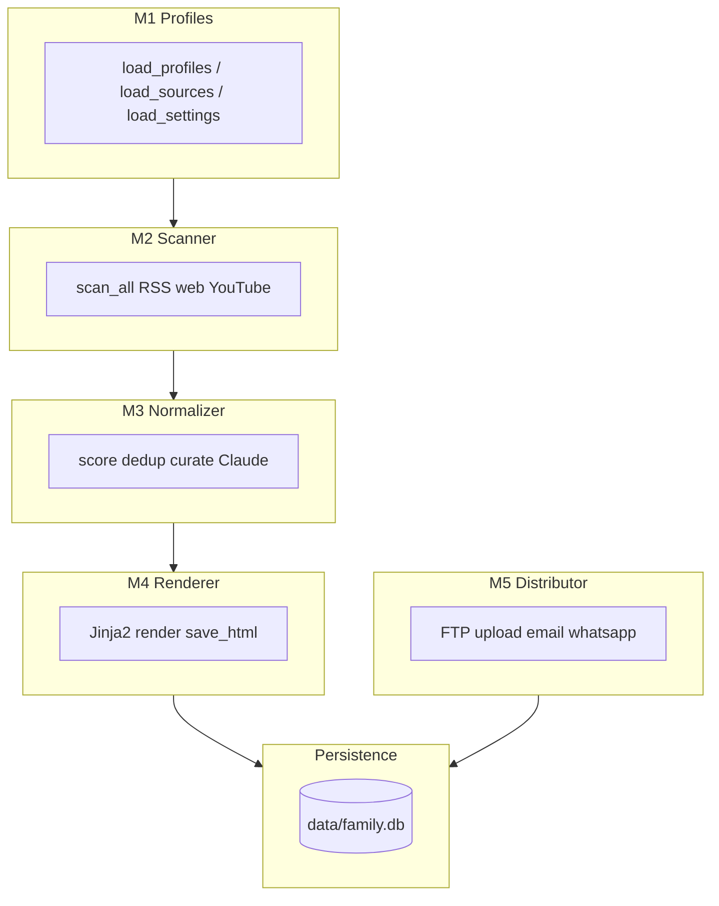

# בקשת השלמה והמשך — Family Newsletter (Cowork)

**תאריך:** 2026-04-10 (יום שישי)  
**נמען:** צוות Cowork (בוני הפרויקט)  
**מקור:** סביבה מקומית (Local Agent / Team 100)  
**יעד מוצרי דחוף:** ניוזלטר **חי**, איכותי, **מוכן להפצה ביום ראשון** (חלון ביצוע: שישי–שבת).

**עדכון ביצוע אוטומטי — 2026-04-10 (~14:24–14:31 מקומי):** הורצו **`weekly-build`** (אחרי ניקוי DB/HTML) ו-**`weekly-send`**. תוצאות מלאות ב-[`REPORT_PILOT_v3.0.0_2026-04-10.md`](REPORT_PILOT_v3.0.0_2026-04-10.md). בקצרה: **כל קריאות Anthropic נכשלו ב-HTTP 401** (מפתח ב-`.env` נדחה על ידי ה-API — יש לתקן/לסובב מפתח). **ה-FTP נכשל ב-530 Login incorrect** — מיילים לא נשלחו. הותקן חבילת **`anthropic`** ב-`venv` והופעלה ב-[`requirements.txt`](requirements.txt).

---

## 1. מטרת המסמך

מסמך זה מרכז:

1. **מה בוצע** בסביבה המקומית לאחר משיכת `origin/main` ותג `v3.0.0`.
2. **מה עובד** בפועל בצינור (pipeline) ומה **חסר או נכשל** בבדיקות קבלה.
3. **מפת מנגנון** (רמת מודולים וקבצים) כדי שתוכלו להבין במהירות איך המערכת בנויה ומה תפקיד כל רכיב.
4. **רשימת השלמת הגדרות** (משתני סביבה, FTP/URL, SMTP) — **ללא ערכי סוד**; רק שמות משתנים וסטטוס.
5. **שאלות ממוקדות** לצוות Cowork כדי לאפשר ייצוב, סגירת פערים, והמשך פיתוח (כולל M6 ומעבר).
6. **בקשה למשוב דרך Git** (ראו סעיף 9).

מסמכים משלימים ב-repo:

| מסמך | תיאור קצר |
|------|-----------|
| [REPORT_PILOT_v3.0.0_2026-04-10.md](REPORT_PILOT_v3.0.0_2026-04-10.md) | דוח פיילוט E2E v3.0.0 — סטטוס PARTIAL, חסימות, המלצות תפעול |
| [MANDATE_TEAM100_PILOT_v3.0.0.md](MANDATE_TEAM100_PILOT_v3.0.0.md) | מנדט פיילוט מלא (קריטריונים, ולידציה, הפצה) |
| [MANDATE_SERVER_PILOT_E2E_2026-04-10.md](MANDATE_SERVER_PILOT_E2E_2026-04-10.md) | מנדט שרת / E2E נוסף |
| [MANDATE_COWORK_BUGFIX_V2_2026-04-10.md](MANDATE_COWORK_BUGFIX_V2_2026-04-10.md) | מנדט באגים / תיקונים Cowork |
| [STYLE_GUIDE.md](STYLE_GUIDE.md) | מדריך עריכה מחייב (Style A/B) |

---

## 2. בטיחות: מפתח Claude / Anthropic

**אין להדביק מפתחות API בצ'אט, ב-Issue, או ב-commit.**

- הזנה מומלצת: קובץ **`.env`** מקומי (בדרך כלל ב-`.gitignore`), או Secret Manager / Keychain.
- שם המשתנה הצפוי בקוד: **`ANTHROPIC_API_KEY`** (ראו [`src/token_tracker.py`](src/token_tracker.py)).
- אם מפתח דלף — **לסובב** מפתח ב-[Anthropic Console](https://console.anthropic.com/) ולהחליף בכל הסביבות.

---

## 3. סיכום ביצועים בסביבה המקומית (מה בוצע)

| פעולה | תוצאה |
|--------|--------|
| `git fetch` / `git pull origin main` | עדכני; אומת קומיט `7ab2b14` ותג `v3.0.0` |
| `venv`, `pip install`, חבילת `anthropic` | `anthropic` מותקן ב-venv; נוסף ל-[`requirements.txt`](requirements.txt) |
| מחיקת `data/family.db` ו-`2026-04-10.html` | בוצע לפני בנייה |
| `weekly-build` (ללא `--mock`) | **הושלם** — M2: **160** פריטים; **10** נבחרו; מזג אוויר OK; **כל קריאות Claude → 401**; עלות טוקן **$0**; HTML ~**40.6 KB**; **אין** מחרוזות `[Mock response]` (שימוש ב-fallbackים סטטיים ב-`m3`) |
| ולידציה בסיסית | ראו דוח; `Mock response`: **0** |
| `weekly-send` | **נכשל** — FTP **530 Login incorrect**; **לא** נשלחו מיילים |
| ניסוי נפרד עם `UPRESS_*` לנתיב `agents/newsletter` | **530** — אותו כשל התחברות (לא אימתנו נתיב עד סוף) |

**מסקנה:** יש לתקן **מפתח Anthropic תקף** (401) ו-**התחברות FTP תקפה** (530) לפני מהדורה חיה לראשון.

---

## 4. מה עובד ומה חסר

### 4.1 עובד (verified locally / logs)

- **M1 — פרופילים:** טעינת משפחה מ-[`config/family.json`](config/family.json) דרך [`src/m1_profiles.py`](src/m1_profiles.py).
- **M2 — סריקה:** משיכת RSS/מקורות אמיתיים; בבנייה לדוגמה נאספו עשרות פריטים ממקורות פעילים (חלק מהמקורות נכשלו או החזירו 0 — ראו לוגים).
- **M3 — נורמליזציה ו-AI:** לוגיקת קיראייט, dedup, גשרים, חידה, סקר — **תלויה ב-Claude**. אם ה-API מחזיר שגיאה (למשל **401**), הקוד נופל ל-**fallbackים** ב-try/except — לא בהכרח mock מ-`token_tracker`.
- **מזג אוויר:** Open-Meteo (ללא מפתח) — עבד בלוג (פרדס חנה / בזל).
- **M4 — רינדור:** Jinja2 — [`templates/newsletter.html.j2`](templates/newsletter.html.j2); גרסה [`SYSTEM_VERSION`](src/m4_renderer.py) ו-`build_timestamp`.
- **M5 — הפצה:** **נוסה** — נכשל ב-**FTP 530**; הקוד ב-[`src/m5_distributor.py`](src/m5_distributor.py) לא מגיע לשליחת מיילים כשההעלאה נכשלת.

### 4.2 חסר / סיכונים

| נושא | פירוט |
|------|--------|
| **`ANTHROPIC_API_KEY`** | מוגדר ב-`.env` אך ה-API החזיר **401 Unauthorized** — יש **מפתח לא תקף / בוטל / פרויקט**; לעדכן בקונסולת Anthropic |
| **FTP / `UPRESS_SFTP_*`** | **530 Login incorrect** — לוודא משתמש/סיסמה בפאנל uPress; האם החשבון נועד לתיקיית `agents/newsletter` או לנתיב אחר? |
| **התאמת FTP ל-URL ציבורי** | לאחר תיקון login — ליישר `UPRESS_UPLOAD_PATH` + `UPRESS_PUBLIC_BASE` עם מבנה האתר |
| **קישורים 403 ב-HEAD** | חלק מהאתרים חוסמים בוטים; HEAD ≠ דפדפן — צריך מדיניות בדיקה |
| **תבנית "character placeholder"** | טקסט/מחלקות שמופיעים ב-grep ל-"placeholder" גם כשההתנהגות הצפויה היא emoji fallback |
| **צילומי מסך אוטומטיים** | כלי דפדפן IDE — timeout; לא ארטיפקט ויזואלי מלא |
| **הפצה למשפחה** | **לא בוצעה** — כשל FTP |

---

## 5. מפת מנגנון (מודולים ותפקידים)



| מודול | קובץ עיקרי | מטרה |
|--------|------------|------|
| CLI / זרימה | [`src/orchestrator.py`](src/orchestrator.py) | `weekly-build`, `weekly-send`, `weekly-survey`, aliases ל-daily |
| M1 | [`src/m1_profiles.py`](src/m1_profiles.py) | טעינת משפחה, מקורות, הגדרות |
| M2 | [`src/m2_scanner.py`](src/m2_scanner.py) | איסוף NCIs מ-RSS/רשת/YouTube |
| M3 | [`src/m3_normalizer.py`](src/m3_normalizer.py) | דירוג, יצירת NEO, קריאות Claude, פתיח/סיום, מזג אוויר |
| M4 | [`src/m4_renderer.py`](src/m4_renderer.py) | רינדור HTML, נכסי דמויות, גרסה |
| M5 | [`src/m5_distributor.py`](src/m5_distributor.py) | העלאת FTP, שליחה, אימות URL |
| M6 | [`src/m6_feedback.py`](src/m6_feedback.py) | משוב / וובהוק (הרחבה עתידית) |
| מודלים | [`src/models.py`](src/models.py) | NCI, NEO, `GeneratedContent`, וכו' |
| DB | [`src/db.py`](src/db.py) | SQLite |
| סביבה | [`src/env_compat.py`](src/env_compat.py) | FTP/SMTP/URL bases |
| עלות | [`src/token_tracker.py`](src/token_tracker.py) | קריאות Claude + mock fallback |

---

## 6. רשימת השלמת הגדרות (checklist ל-Cowork)

סמנו: **OK** / **חסר** / **לא רלוונטי**.

### 6.1 AI

- [ ] `ANTHROPIC_API_KEY` — **מוגדר אבל נדחה ב-API (401)** — להחליף במפתח תקף ולבצע `weekly-build` מחדש
- [ ] אותו סוד ב**שרת** הבילד (אם שונה מהמחשב המקומי)

### 6.2 FTP / אתר ציבורי

- [ ] `UPRESS_SFTP_HOST`, `UPRESS_SFTP_USER`, `UPRESS_SFTP_PASS`, `UPRESS_SFTP_PORT` — **אומתו בפועל: 530** — לתקן פרטי התחברות
- [ ] `UPRESS_PUBLIC_BASE` — בסיס HTTPS **מדויק** כפי שהמשתמשים רואים (כולל `www` אם נדרש)
- [ ] `UPRESS_UPLOAD_PATH` — נתיב מרוחק ב-FTP שמתאים ל-URL הציבורי (למשל תיקיית `agents/newsletter` אם זה המבנה ב-uPress)

### 6.3 דוא"ל

- [ ] `EMAIL_SMTP_HOST`, `EMAIL_SMTP_PORT` (או aliases)
- [ ] `EMAIL_PASSWORD` / `SMTP_PASS` (כפי שממופה ב-[`env_compat.py`](src/env_compat.py))
- [ ] `EMAIL_FROM` / `SMTP_FROM` לפי מותג "Family Newsletter"

### 6.4 אופציונלי

- `TWILIO_*` — אם `primary_channel` הוא WhatsApp ב-[`config/settings.json`](config/settings.json)

---

## 7. ציר זמן מוצע: שישי (היום) → ראשון (הפצה)

| חלון | פעולה |
|------|--------|
| **שישי (מיידי)** | `ANTHROPIC_API_KEY` ב-`.env` (אומת) → מחיקת `data/family.db` + HTML לתאריך המהדורה → `weekly-build` → grep/בדיקות מהמנדט (בלי `[Mock response]`) |
| **שבת** | תיקון פערים (קישורים, תבנית, נתיב FTP אם נדרש), בדיקה ויזואלית ידנית בדפדפן |
| **לפני ראשון** | `weekly-send`, `curl` 200, דגימת דף חי, וידוא מיילים ל-5 חברי משפחה (מ-[`config/family.json`](config/family.json)) |

**הערה:** ב-[`config/settings.json`](config/settings.json) מוגדרים זמני build/send שבועיים (למשל שישי) — אם **המוצר** דורש שליחה ב**ראשון**, ייתכן צורך בעדכון `schedule` / cron / תיעוד ב-[`run.sh`](run.sh). זו שאלה לפתרון משותף (ראו סעיף 8).

---

## 8. שאלות לצוות Cowork (למענה ב-Git)

1. **תזמון:** האם יעד ההפצה הסופי הוא ראשון בבוקר IST? אם כן, מה תצורת ה-cron המומלצת (יום + שעה) מול `run.sh`?
2. **FTP:** מה הנתיב הקנוני ב-uPress עבור המהדורה בכתובת `https://www.nimrod.bio/agents/newsletter/{date}/index.html`? האם `UPRESS_UPLOAD_PATH` הנוכחי בפרויקט/שרת תואם?
3. **403 בקישורים:** האם לאמץ GET עם User-Agent דפדפן, או לקבל ≤2 כשלים כ"תקין", או לסנן מקורות בעייתיים?
4. **תבנית דמויות:** האם להחליף את הטקסט "character placeholder" ב-emojis בלבד כדי שבדיקות grep לא ייפסלו בטעות?
5. **Cirque / Aerial Expo:** האם לעדכן מקורות ב-[`config/sources.json`](config/sources.json) או להשאיר כ-degraded?
6. **תקציב AI:** האם סף `$` שבועי ב-[`config/settings.json`](config/settings.json) מעודכן למודל בפועל (`claude-sonnet-4-6`)?
7. **M6:** מתי מתוכנן webhook / סקר חיצוני, ואיך זה משפיע על M5?

---

## 9. משוב דרך Git (בקשה מפורשת)

אנא החזירו משוב באחת מהצורות:

- **Issue** ב-GitHub עם תשובות לסעיף 8 + סטטוס checklist בסעיף 6; או
- **PR** שמסמן תיקון תצורה/תיעוד + תגובה בגוף ה-PR; או
- קובץ תגובה ב-repo (למשל `RESPONSE_COWORK_HANDOFF_2026-04-10.md`) ב-branch ייעודי.

**תבנית תגובה קצרה (העתקה):**

```markdown
## Cowork response — 2026-04-10
- Confirmed FTP path: ...
- Sunday schedule decision: ...
- Open questions resolved: ...
- Remaining risks: ...
```

---

## 10. אנשי קשר לוגיים (ללא PII בקובץ זה)

פרטי המשפחה והמיילים מוגדרים ב-[`config/family.json`](config/family.json) — לא לשכפל כאן; עדכון רק דרך הקונפיג או מנדט נפרד.

---

*מסמך זה נוצר לצורך רציפות עבודה בין הסביבה המקומית לבין צוות Cowork. אין לכלול סודות בקובץ זה.*
